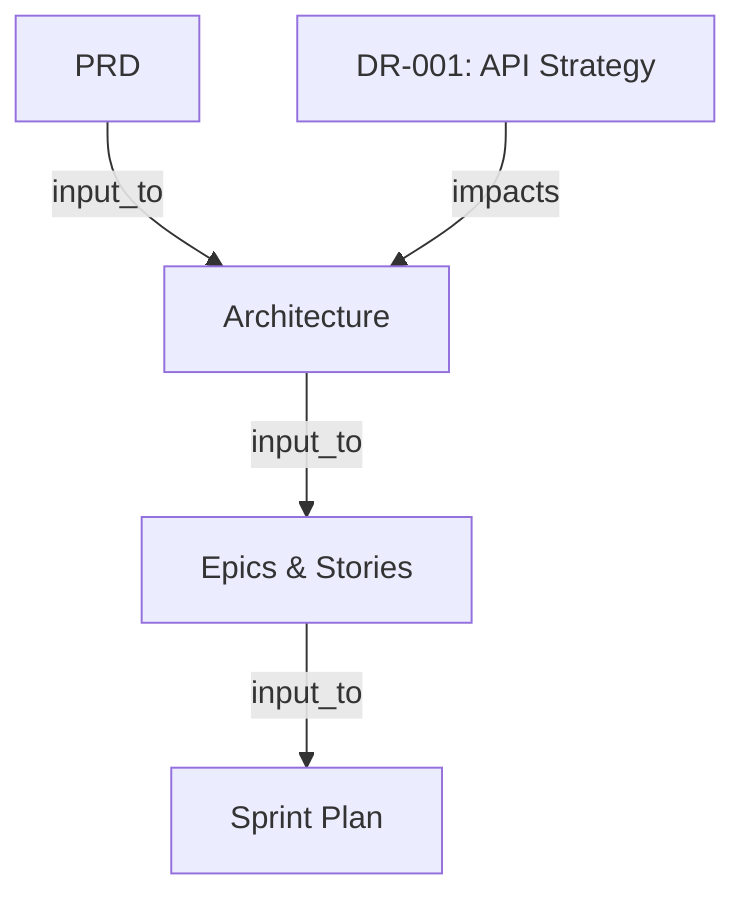

# MDAN — Multi-Agent Development Agentic Network

🇫🇷 [Français](README.md) · 🇬🇧 English


[](https://www.npmjs.com/package/mdan-method)
[](https://github.com/khalilbenaz/MDAN/actions/workflows/ci.yml)
[](LICENSE)
<!-- generated:badges -->
[](#available-commands)
[](#the-agents)
[](#the-agents)
<!-- /generated:badges -->
[](https://glama.ai/mcp/servers/khalilbenaz/MDAN)

**MDAN** is an AI-driven development framework: specialized agents, interactive step-by-step wizards, persistent project memory, a structured debate protocol and a context graph that traces every artifact. Use it through slash commands in your IDE **or** as an MCP server.

**100% free and open source.** Made in Morocco.

---

## Quick start

```bash
npx mdan-method install
```

The interactive installer asks for the language, optional packs, the IDE(s) and your name, then:

- copies the content into `_mdan/`;
- generates the `/mdan-*` commands for each chosen IDE;
- writes the config (`_mdan/*/config.yaml`) and the initial state (`_mdan/state/`);
- optionally adds the MCP server to `.mcp.json`.

Then, in your IDE, type `/mdan-` to see every command.

**Non-interactive (CI, scripts):**

```bash
npx mdan-method install --yes --lang en --ide claude-code,cursor --modules fintech,db-optimization --mcp
```

| Option | Values |
|--------|--------|
| `--lang` | `fr-darija` (default) · `fr` · `en` · `darija` |
| `--ide` | `claude-code` (default) · `cursor` · `opencode` · `gemini` · `qwen` (comma-separated for several) |
| `--modules` | `qa` · `payments-ma` · `fintech` · `devops-azure` · `db-optimization` · `ecosystem` · `all` · `none` |
| `--scale` | `auto` (default) · `solo` · `team` · `enterprise`: quality-gate strictness |
| `--user` | Your name, used by the agents |
| `--mcp` | Adds the MDAN MCP server to `.mcp.json` |
| `--force` | Overwrites files you modified |

**Updating without losing your changes:**

```bash
npx mdan-method@latest update
npx mdan-method update --channel next    # try the next version
```

Every installed file is tracked by its hash (`_mdan/_config/files-manifest.csv`). A file you modified is never overwritten: the new version is written next to it as `<file>.mdan-new`. In `config.yaml` files, only the managed keys (`user_name`, `communication_language`, `project_name`) are updated.

---

## MCP Server

Any [MCP](https://modelcontextprotocol.io/) client (Claude Code, Claude Desktop, Cursor, …) can use MDAN directly.

```json
{
  "mcpServers": {
    "mdan": {
      "command": "npx",
      "args": ["-y", "mdan-method", "serve"],
      "env": { "MDAN_PROJECT_ROOT": "." }
    }
  }
}
```

```bash
mdan serve                                # stdio (default)
mdan serve --http --port 3100             # Streamable HTTP on /mcp, health check on /health
mdan serve --http --host 0.0.0.0 --token $MDAN_HTTP_TOKEN   # exposed: token mandatory
docker build -t mdan-mcp . && docker run -i --rm -v "$PWD:/workspace" mdan-mcp
```

Without an install in the project, the server serves the content bundled in the package. The graph and decision records are still written into the project.

**Tools**

| Tool | Description |
|------|-------------|
| `mdan_status` | Where the project is: current workflow and step, completed phases, artifacts, decisions, next step |
| `mdan_list_workflows` / `mdan_run_workflow` | List the workflows / load a wizard with its resume point and existing artifacts |
| `mdan_state_update` | Records progress (`start` / `step` / `complete`); on completion, artifacts are added to the graph |
| `mdan_list_agents` / `mdan_consult_agent` | List the agents / load a persona with its layered customization and memories |
| `mdan_customize_agent` | Customizes an agent without touching its file: team layer (`_mdan/custom/<agent>.yaml`, versioned) or personal layer (`.user.yaml`, git-ignored) |
| `mdan_party_mode` | Multi-agent session: `discussion`, `debate` or `consensus` (with each participant's memory) |
| `mdan_memory_remember` / `recall` / `forget` / `end_session` / `list` | Persistent agent memory across sessions (reinforcement, gradual decay, relationships) |
| `mdan_create_decision_record` | Records a DR-XXX (sequential ids) and adds it to the graph, with `impacts` edges |
| `mdan_graph_add_node` / `mdan_graph_add_edge` | Traces an artifact (file hash recorded) / a relation (cycles rejected) |
| `mdan_graph_impact` | Upstream dependencies and downstream impact of an artifact |
| `mdan_graph_stale` | Artifacts changed since registration and downstream artifacts to review |
| `mdan_graph_visualize` | Mermaid diagram of the graph |
| `mdan_check` | Quality gate on the deliverables (placeholders, empty sections, FR/NFR coverage across PRD, architecture and epics, acceptance criteria), strictness driven by project scale |
| `mdan_trace` | Requirement → story → test matrix, coverage and decision; can write it into the graph |
| `mdan_estimate_scope` | How much process a change needs: `oneshot` (quick-dev), `spec` (quick-spec) or `full` (replanning), from the real impact in the graph |
| `mdan_ecosystem_search` / `mdan_ecosystem_read` | Ranked search (name, description) and reading of `~/.claude` skills, agents and commands |
| `mdan_ecosystem_catalog` / `mdan_ecosystem_stats` | Paginated catalog / installed component counts |
| `mdan_export_backlog` | Exports the backlog to CSV, GitHub Issues, Azure DevOps or Jira (dry run by default) |

**Prompts**: every workflow (`create-prd`, `create-architecture`, …) and every agent (`agent-<name>`) is also exposed as an MCP prompt, which lets the client offer them as slash commands.

**Resources**: `mdan://state`, `mdan://config`, `mdan://graph`, `mdan://health` (one-call health report), `mdan://workflow/{name}` and `mdan://agent/{name}` (listable).

> Migrating from v3: the `mdan_workflow_<name>` and `mdan_agent_<name>` tools are replaced by `mdan_run_workflow { name }` and `mdan_consult_agent { name }`, and tool names now use `_` (`mdan_list_workflows`, `mdan_graph_add_node`, …).

---

## Context Graph

A DAG of the project's artifacts and their relations (`input_to`, `derived_from`, `impacts`, `references`). At the end of a workflow, the agent registers the produced artifact via `mdan_graph_add_node`. Decision records from debates are added automatically.

```bash
mdan graph                  # Mermaid
mdan graph --json           # raw JSON
mdan graph --html graph.html
mdan impact <artifact-id>   # upstream + downstream
mdan stale                  # changed artifacts and what to review (exit code 2 if any)
mdan stale --touch <id>     # marks an artifact as reviewed
```



---

## Available commands

Every command starts with `/mdan-`.

### Wizards — Phase 1: Discovery

| Command | Description |
|---------|-------------|
| `/mdan-create-product-brief` | Collaborative product brief in 6 steps: vision, target users, scope, success metrics. |
| `/mdan-market-research` | Market research: competitive analysis, customer behavior, pain points, opportunities. |
| `/mdan-technical-research` | Technical research: technologies, architecture patterns, integrations, trends. |
| `/mdan-domain-research` | Domain research: sector analysis, regulation, competitive landscape. |

### Wizards — Phase 2: Planning

| Command | Description |
|---------|-------------|
| `/mdan-create-prd` | Full PRD in 12 steps: vision, user journeys, scoping, functional and non-functional requirements. |
| `/mdan-create-ux-design` | UX design in 14 steps: discovery, design system, visual foundations, journeys, components, responsive. |

### Wizards — Phase 3: Architecture

| Command | Description |
|---------|-------------|
| `/mdan-create-architecture` | Technical architecture in 8 steps: context, decisions, patterns, structure, validation. |
| `/mdan-create-epics-and-stories` | Breaks requirements into epics and user stories ready for development. |

### Wizards — Phase 4: Build

| Command | Description |
|---------|-------------|
| `/mdan-sprint-planning` | Sprint plan from the epics, with estimation. |
| `/mdan-dev-story` | Implements a story from its spec: TDD, tests, documentation. |
| `/mdan-code-review` | Adversarial code review: bugs, security, pattern violations, and re-validation of what depends on the change (graph). |
| `/mdan-correct-course` | Major mid-sprint change: impact analysis (graph), options, PRD/architecture/epics update, Sprint Change Proposal. |
| `/mdan-retrospective` | Epic or sprint retrospective: observations, root causes, actions; lessons become agent memories. |

### Wizards — Phase 5: Delivery

| Command | Description |
|---------|-------------|
| `/mdan-document-project` | Full project documentation: overview, deep-dives, source tree. |

### Quick flows

| Command | Description |
|---------|-------------|
| `/mdan-quick-dev` | Quick 6-step development for small changes. |
| `/mdan-quick-spec` | Quick 4-step technical spec, ready for implementation. |

### Special modes

| Command | Description |
|---------|-------------|
| `/mdan-party-mode` | Multi-agent, 3 modes: discussion, debate, consensus. |
| `/mdan-debate` | Structured debate (Proponent 🟢 vs Opponent 🔴 + Arbitrator ⚖️), 3 rounds, arbitration, then a decision record. |
| `/mdan-brainstorming` | Brainstorming with 12+ techniques (SCAMPER, Six Thinking Hats, Mind Mapping…). |

### Test Architect pack — `--modules qa`

Every test deliverable is linked to the graph: "which tests should re-run if this story changes?" has an answer.

| Command | Description |
|---------|-------------|
| `/mdan-qa-test-design` | Risk-based test strategy: P0-P3 priorities (probability × impact), test levels per story/epic. |
| `/mdan-qa-atdd` | Failing acceptance tests (Given/When/Then) generated from the criteria, before implementation. |
| `/mdan-qa-traceability` | Requirement → story → test matrix, coverage gaps, PASS/CONCERNS/FAIL decision. |
| `/mdan-qa-nfr-assessment` | Performance, security, reliability, maintainability: thresholds and evidence. |
| `/mdan-qa-test-review` | Quality of existing tests (flakiness, isolation, assertions) with a scored grid. |
| `/mdan-qa-ci-gates` | Test pipeline and quality gates in CI (GitHub Actions and Azure DevOps examples). |
| `/mdan-qa-release-gate` | Go/no-go: aggregates everything, blocks if downstream artifacts of a changed spec were not re-checked. |

### Morocco Payments pack — `--modules payments-ma`

Wallets, payment institutions, banks: BAM requirements, ISO 8583/20022, reconciliation. Regulatory ceilings are marked "to verify against the current BAM circular".

| Command | Description |
|---------|-------------|
| `/mdan-pay-kyc-limits` | Wallet KYC tiers, ceilings (balance, monthly flows, per operation), tier up/downgrade, control points. |
| `/mdan-pay-txn-flow` | Money-movement flow: states, double-entry postings, idempotency, timeouts, reversals, fees, outbox. |
| `/mdan-pay-iso8583` | ISO 8583 interface spec: MTI, DE mapping, response codes, reversals/advices, test vectors. |
| `/mdan-pay-recon` | End-of-day reconciliation: sources, matching rules, discrepancy categories, auto-resolution. |
| `/mdan-pay-compliance-review` | Review of a feature against BAM / AML-CFT / CNDP / PCI DSS, with a gap report. |

Reference sheets included: Morocco RIB/IBAN structure with key computation (`_mdan/payments-ma/data/rib-iban.md`) and an ISO 8583 cheat sheet.

### Tasks

| Command | Description |
|---------|-------------|
| `/mdan-help` | What to do next? Analyzes what's done and recommends the next step. |
| `/mdan-review-adversarial-general` | Critical (adversarial) review of a piece of content. |
| `/mdan-editorial-review-prose`, `/mdan-editorial-review-structure` | Editorial review (style, structure). |
| `/mdan-shard-doc`, `/mdan-index-docs` | Splits a large document or indexes a docs folder. |

### CLI

| Command | Description |
|---------|-------------|
| `mdan install` / `mdan update` | Installs / updates MDAN in a project |
| `mdan status` | Where the project is and what the next step is |
| `mdan memory [agent]` | Shows or clears an agent's memories |
| `mdan check [files]` | Quality gate on the deliverables (exit code 1 on FAIL, usable in CI) |
| `mdan trace [--graph]` | Requirement → story → test traceability matrix |
| `mdan scope "<change>"` | Recommends quick-dev, quick-spec or full replanning |
| `mdan export --to csv\|github\|ado\|jira` | Exports epics and stories (dry run by default, `--apply` to send; re-running updates instead of duplicating) |
| `mdan bundle [agent…] [--all]` | Web bundles for ChatGPT (GPT), Gemini (Gem) or Claude (Project): instructions + knowledge file |
| `mdan serve [--http]` | Starts the MCP server |
| `mdan graph [--since <id>]`, `mdan impact <id>`, `mdan stale` | Context Graph (`--since DR-001` highlights a decision and everything it impacts) |
| `mdan validate` | Checks that every file reference in `_mdan` resolves |

---

## The Agents

Agents are specialized AI personas, invocable directly. This table is generated from the agent files by `npm run build`.

<!-- generated:agents -->
### Core

| Command | Agent | Role |
|----------|-------|------|
| `/mdan-agent-analyst` | 📊 Amina | **Business Analyst** — Business Analyst + Requirements Discovery Lead |
| `/mdan-agent-architect` | 🏗️ Reda | **System Architect** — System Architect + Technical Design Leader |
| `/mdan-agent-dev` | 💻 Haytame | **Senior Developer** — Senior Implementation Engineer + TDD Practitioner |
| `/mdan-agent-mdan-master` | 🧙 MDAN Master | **Orchestrateur Principal, Gardien du Contexte, Directeur des Wizards** — Master Orchestrator + MDAN Expert + Context Guardian |
| `/mdan-agent-pm` | 📋 Khadija | **Product Manager** — Product Manager + Scope Guardian |
| `/mdan-agent-scrum-master` | 🏃 Nadia | **Scrum Master** — Technical Scrum Master + Delivery Guardian |
| `/mdan-agent-security` | 🛡️ Yassir | **Security Engineer** — Application Security Engineer + Threat Modeling Lead |
| `/mdan-agent-tech-writer` | 📚 Youssef | **Technical Writer** — Technical Documentation Specialist + Knowledge Curator |
| `/mdan-agent-ux-designer` | 🎨 Jihane | **UX Designer** — User Experience Designer + Interaction Specialist |

### Database Optimization pack

| Command | Agent | Role |
|----------|-------|------|
| `/mdan-agent-db-optimization-indexing-specialist` | 📑 Salma | **Indexing Specialist** — Database Indexing Strategy Expert |
| `/mdan-agent-db-optimization-performance-analyst` | 📈 Mehdi | **DB Performance Analyst** — Database Performance Analysis Expert |
| `/mdan-agent-db-optimization-query-optimizer` | 🔍 Driss | **Query Optimizer** — Database Query Optimization Expert |

### DevOps & Azure pack

| Command | Agent | Role |
|----------|-------|------|
| `/mdan-agent-devops-azure-azure-specialist` | ☁️ Hamza | **Azure Specialist** — Azure Cloud Architecture Expert |
| `/mdan-agent-devops-azure-cicd-architect` | 🔄 Yassine | **CI/CD Architect** — CI/CD Pipeline Architecture Expert |
| `/mdan-agent-devops-azure-devops-engineer` | ⚙️ Omar | **DevOps Engineer** — DevOps Engineering and Operations Expert |

### Ecosystem pack

| Command | Agent | Role |
|----------|-------|------|
| `/mdan-agent-ecosystem-ia-master` | 🧠 Fayçal | **IA Master** — IA Master — Chief AI Strategist, owns all AI/ML architecture, orchestrates 130+ AI skills and 48 AI agents. Reports to Khalil (MDAN Master) for project-level decisions. |
| `/mdan-agent-ecosystem-data-scientist` | 📊 Saad | **Data Scientist** — Data Scientist — orchestrates data analysis, visualization, and ML skills |
| `/mdan-agent-ecosystem-devops-commander` | 🚀 Ilyas | **DevOps Commander** — DevOps Commander — orchestrates 30+ DevOps skills, 39 infra agents, 11 deployment commands |
| `/mdan-agent-ecosystem-fullstack-architect` | 🏗️ Amine | **Fullstack Architect** — Fullstack Architecture Expert — routes to 200+ development skills and 100+ dev agents |
| `/mdan-agent-ecosystem-marketing-strategist` | 📈 Imane | **Marketing Strategist** — Marketing Strategist — orchestrates 25+ marketing skills and publishing commands |
| `/mdan-agent-ecosystem-product-lead` | 💡 Adnane | **Product Lead** — Product Lead — orchestrates product, project management, and team skills |
| `/mdan-agent-ecosystem-research-team-lead` | 🔬 Leila | **Deep Research Team Lead** — Deep Research Orchestrator — coordinates research teams using ecosystem agents and scientific skills |
| `/mdan-agent-ecosystem-security-specialist` | 🛡️ Samir | **Security Specialist** — Security Expert — orchestrates 40+ security skills and 21 security agents |
| `/mdan-agent-ecosystem-skill-dispatcher` | 🎯 Zineb | **Ecosystem Skill Dispatcher** — Ecosystem Orchestrator — Routes requests to the right specialist from 1,053 skills, 418 agents, 340 commands |

### FinTech pack

| Command | Agent | Role |
|----------|-------|------|
| `/mdan-agent-fintech-compliance-officer` | ⚖️ Rachid | **Compliance Officer** — Regulatory Compliance and Risk Assessment Expert |
| `/mdan-agent-fintech-financial-analyst` | 📊 Sanae | **Financial Analyst** — Financial Analysis and Modeling Expert |
| `/mdan-agent-fintech-risk-manager` | 🛡️ Karim | **Risk Manager** — Financial Risk Management Expert |

### Morocco Payments pack

| Command | Agent | Role |
|----------|-------|------|
| `/mdan-agent-payments-ma-bam-compliance` | ⚖️ Houda | **BAM Compliance Officer** — Officier de Conformité Bank Al-Maghrib (BAM) pour établissements de paiement |
| `/mdan-agent-payments-ma-payments-architect` | 💳 Anas | **Payments Systems Architect** — Architecte Systèmes de Paiement (switch, wallet, core banking) |
| `/mdan-agent-payments-ma-recon-lead` | 🧾 Samira | **Reconciliation & Settlement Lead** — Responsable Rapprochement (EOD) & Règlement |

### Test Architect pack (QA)

| Command | Agent | Role |
|----------|-------|------|
| `/mdan-agent-qa-test-architect` | 🧪 Fatima | **Test Architect** — Test Architecture & Quality Gate Expert |
<!-- /generated:agents -->

*Note: the roles above are the personas' own text, as authored (mostly English already; module titles stay in French where they are proper names of the source files). Command names never change across languages.*

The Party mode team (`_mdan/mdan/teams/default-party.csv`) only references real agents; CI checks that, plus unique names.

---

## Language and communication style

The language is chosen at install time (`--lang`) and stored in `_mdan/mdan/config.yaml` (`communication_language`). Every language and style rule is centralized in **`_mdan/core/rules.md`**, which every agent and wizard loads. Changing the language is therefore a single key change.

The default style is ultra-concise: tool first, result first, no filler, no unnecessary recap.

---

## Architecture

```
_mdan/                          ← Content (single source of truth)
├── core/                       ← Engine: mdan-master, rules.md, tasks, workflow.xml
├── mdan/                       ← Main module: workflows, teams, config
├── fintech/ devops-azure/ db-optimization/ ecosystem/   ← Optional packs
├── _config/                    ← Generated manifests + agent customization
└── state/                      ← Runtime state (MDAN-STATE.json, context-graph.json)

tools/
├── build/                      ← build.js (manifests + commands), validate.js (references)
├── cli/                        ← mdan install|update|serve|graph|impact|stale|validate
├── lib/                        ← sources, IDE commands, CSV, safe paths, atomic writes
└── mcp/                        ← MCP server (tools, prompts, resources; stdio + HTTP)
```

---

## Documentation

- [Documentation map](docs/index.md)
- [Tutorial: your first project](docs/tutorials/first-project.md)
- [Reference: CLI](docs/reference/cli.md) · [MCP server](docs/reference/mcp.md) · [Modules](docs/reference/modules.md) · [Config](docs/reference/config.md)
- [Explanation: concepts](docs/explanation/concepts.md) · [MDAN vs MDAN-METHOD](docs/explanation/mdan-vs-mdan.md)

---

## Contributing

```bash
git clone https://github.com/khalilbenaz/MDAN.git && cd MDAN
npm ci
npm run build      # regenerates _mdan/_config/*.csv, .claude/commands and the generated README sections
npm run check      # lint + build up to date + valid references + tests
ANTHROPIC_API_KEY=... npm run eval   # evaluation harness: an LLM runs the wizards, the deliverable goes through mdan check
```

To add an agent or a workflow, create the source file under `_mdan/<module>/agents/` or `_mdan/<module>/workflows/` (frontmatter `name` + `description`), then run `npm run build`. There is nothing else to maintain by hand. CI checks that the generated files are up to date. See [How to write a module](docs/how-to/write-a-module.md).

---

## License

MIT

---

<p align="center">
<!-- generated:footer -->
  <strong>31 wizards · 31 agents · 6 packs · MCP server · Context Graph · Debate/Consensus</strong><br>
<!-- /generated:footer -->
  Made in Morocco by <a href="https://github.com/khalilbenaz">@khalilbenaz</a>
</p>
