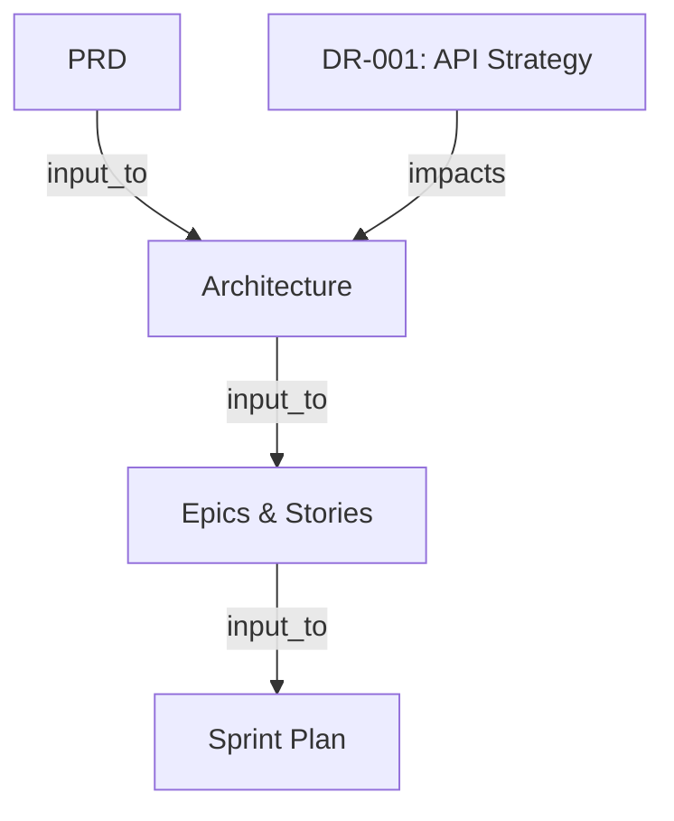

# MDAN — Multi-Agent Development Agentic Network


[](https://www.npmjs.com/package/mdan-method)
[](LICENSE)
[]()
[]()
[]()
[]()

**MDAN** est un framework de développement piloté par l'IA, composé d'agents spécialisés, de wizards interactifs pas-à-pas, d'un système de mémoire persistante et d'un protocole de débat structuré.

**100% gratuit et open source.** Made in Morocco.

---

## Nouveautés v3.1 🚀

### Module Ecosystem — 2,014 composants

MDAN est désormais connecté à l'**écosystème complet Claude Code** : **1,053 skills, 418 agents, 340 commandes, 67 hooks, 67 settings, 69 MCPs**.

Sources : [khalilbenaz/claude-skills-collection](https://github.com/khalilbenaz/claude-skills-collection) + [aitmpl.com](https://www.aitmpl.com/) (davila7/claude-code-templates)

9 nouveaux agents spécialisés, dirigés par **Fayçal (IA Master)** et supervisés par **Khalil (MDAN Master)**.

### Serveur MCP

MDAN fonctionne comme **serveur MCP** — tout IDE compatible [MCP](https://modelcontextprotocol.io/) (Claude Code, Cursor, etc.) peut se connecter directement et utiliser tous les workflows et agents comme des outils.

```bash
mdan serve            # transport stdio
mdan serve --sse      # SSE pour le distant
```

Ajoutez cette configuration dans votre `.mcp.json` :

```json
{
  "mcpServers": {
    "mdan": {
      "command": "npx",
      "args": ["-y", "mdan-method", "serve"],
      "env": { "MDAN_PROJECT_ROOT": "." }
    }
  }
}
```

**Outils MCP disponibles :**

| Outil | Description |
|-------|-------------|
| `mdan_list-workflows` | Liste tous les workflows |
| `mdan_workflow_{name}` | Exécute un workflow (create-prd, create-architecture, etc.) |
| `mdan_list-agents` | Liste tous les agents installés |
| `mdan_agent_{name}` | Consulte un agent spécifique |
| `mdan_graph_impact` | Analyse d'impact en aval d'un artifact |
| `mdan_graph_visualize` | Diagramme Mermaid du context graph |
| `mdan_orchestrate_party-mode` | Session multi-agent (discussion/débat/consensus) |
| `mdan_orchestrate_create-decision-record` | Crée un decision record |
| `mdan_ecosystem_catalog` | Affiche le catalogue complet de l'écosystème (2,014 composants) |
| `mdan_ecosystem_search-skills` | Recherche parmi 1,053 skills par mot-clé |
| `mdan_ecosystem_search-agents` | Recherche parmi 418 templates d'agents |
| `mdan_ecosystem_search-commands` | Recherche parmi 340 commandes |
| `mdan_ecosystem_read-skill` | Lit le contenu d'un skill |
| `mdan_ecosystem_read-agent` | Lit le contenu d'un template d'agent |
| `mdan_ecosystem_stats` | Statistiques d'installation de l'écosyst��me |

**Ressources MCP :** `mdan://state`, `mdan://config`, `mdan://graph`

### Context Graph

DAG léger qui trace toutes les relations entre les artifacts. Chaque workflow terminé enregistre automatiquement son artifact dans le graphe.

```bash
mdan impact <artifact-id>   # Analyse d'impact en aval
mdan graph                   # Diagramme Mermaid
mdan graph --json            # JSON brut
```



Les Decision Records des débats sont aussi enregistrés dans le graphe.

### Orchestration multi-agent avancée

Le Party Mode propose **3 modes** :

| Mode | Description |
|------|-------------|
| **Discussion** | Conversation libre multi-agent (mode original) |
| **Débat** | Argumentation structurée à 3 rôles → Decision Record |
| **Consensus** | N agents convergent vers une position commune |

**Mode Débat** — 3 rôles : Partisan 🟢, Opposant 🔴, Arbitre ⚖️. 3 rounds structurés. Produit automatiquement un Decision Record (DR-XXX) enregistré dans le Context Graph. Disponible en sous-mode de party-mode OU directement via `/mdan-debate`.

**Mode Consensus** — 3-5 agents passent par 4 phases : positions initiales → cartographie accord/désaccord → itérations de convergence → synthèse.

**Agent Sidecars** — Mémoire persistante pour chaque agent entre les sessions. Les agents se souviennent des observations, préférences et décisions des sessions précédentes.

### Sélection de langue

À l'installation, MDAN vous demande votre langue préférée :
1. 🇫🇷🇲🇦 Français + Darija Marocaine (par défaut)
2. 🇫🇷 Français uniquement
3. 🇬🇧 English
4. 🇲🇦 Darija Marocaine

---

## Démarrage rapide

```bash
npx mdan-method install
```

L'installeur vous guide pour choisir les modules et votre IDE (Claude Code, Gemini CLI, OpenCode, QwenCoder...).

Ensuite, dans votre IDE, tapez `/mdan-` pour voir toutes les commandes disponibles.

---

## Commandes disponibles

Toutes les commandes commencent par `/mdan-`.

### Wizards — Phase 1 : Découverte

| Commande | Description |
|----------|-------------|
| `/mdan-create-product-brief` | Crée un product brief collaboratif en 6 étapes. Définit la vision, les utilisateurs cibles, le scope et les métriques de succès. |
| `/mdan-market-research` | Recherche de marché : analyse concurrentielle, comportement clients, pain points et opportunités. |
| `/mdan-technical-research` | Recherche technique : technologies, patterns d'architecture, intégrations et tendances. |
| `/mdan-domain-research` | Recherche de domaine : analyse sectorielle, réglementation, paysage concurrentiel. |

### Wizards — Phase 2 : Planification

| Commande | Description |
|----------|-------------|
| `/mdan-create-prd` | Crée un Product Requirements Document complet en 12 étapes. Vision, user journeys, scoping, requirements fonctionnels et non-fonctionnels. |
| `/mdan-create-ux-design` | Planifie le design UX en 14 étapes : discovery, design system, fondations visuelles, user journeys, composants et responsive. |

### Wizards — Phase 3 : Architecture

| Commande | Description |
|----------|-------------|
| `/mdan-create-architecture` | Crée l'architecture technique en 8 étapes : contexte, décisions, patterns, structure et validation. |
| `/mdan-create-epics-and-stories` | Découpe les requirements en epics et user stories prêtes pour le développement. |

### Wizards — Phase 4 : Construction

| Commande | Description |
|----------|-------------|
| `/mdan-sprint-planning` | Génère un sprint plan depuis les epics. Organise les stories en sprints avec estimation. |
| `/mdan-dev-story` | Implémente une story depuis son fichier de spec. TDD, tests et documentation automatique. |
| `/mdan-code-review` | Review de code adversariale : détecte les bugs, problèmes de sécurité et violations de patterns. |

### Wizards — Phase 5 : Livraison

| Commande | Description |
|----------|-------------|
| `/mdan-document-project` | Génère la documentation complète du projet : overview, deep-dives, source tree. |

### Flows rapides

| Commande | Description |
|----------|-------------|
| `/mdan-quick-dev` | Développement rapide en 6 étapes pour les petits changements. Détection de mode, contexte, exécution, self-check et review. |
| `/mdan-quick-spec` | Spec technique rapide en 4 étapes. Produit une spec prête pour l'implémentation. |

### Modes spéciaux

| Commande | Description |
|----------|-------------|
| `/mdan-party-mode` | Mode multi-agents : 3 modes — Discussion, Débat, Consensus. Agent sidecars, Decision Records, Context Graph. |
| `/mdan-debate` | Débat structuré standalone entre agents (Partisan 🟢 vs Opposant 🔴 + Arbitre ⚖️). 3 rounds → Arbitrage → Decision Record. |
| `/mdan-brainstorming` | Session de brainstorming avec 12+ techniques créatives (SCAMPER, Six Thinking Hats, Mind Mapping, etc.). |

### Commandes CLI

| Commande | Description |
|----------|-------------|
| `mdan serve` | Démarre le serveur MCP (stdio ou SSE) |
| `mdan impact <id>` | Analyse d'impact d'un artifact dans le Context Graph |
| `mdan graph` | Affiche le Context Graph en diagramme Mermaid |

---

## Les Agents

Les agents sont des personnalités IA spécialisées que vous pouvez invoquer directement.

### Équipe principale

| Commande | Agent | Rôle |
|----------|-------|------|
| `/mdan-agent-pm` | Khalil | **MDAN Master** — Orchestre tout le projet, gère les wizards, garde la mémoire |
| `/mdan-agent-analyst` | Amina | **Business Analyst** — Recherche, briefs, analyse de marché |
| `/mdan-agent-architect` | Reda | **Architect** — Architecture système, tech stack, patterns |
| `/mdan-agent-dev` | Haytame | **Developer** — Implémentation, TDD, code propre |
| `/mdan-agent-qa` | Fatima | **QA Engineer** — Tests, qualité, stratégie de test |
| `/mdan-agent-ux-designer` | Jihane | **UX Designer** — Design UX/UI, wireframes, prototypes |
| `/mdan-agent-tech-writer` | Youssef | **Technical Writer** — Documentation technique, guides, API docs |
| `/mdan-agent-sm` | Nadia | **Scrum Master** — Gestion agile, sprints, rétrospectives |
| `/mdan-agent-security` | Yassir | **Security Engineer** — Audit de sécurité, threat modeling, OWASP Top 10 |
| `/mdan-agent-quick-flow-solo-dev` | — | **Solo Dev** — Mode rapide tout-en-un pour développeurs solo |

### Pack FinTech

| Commande | Agent | Rôle |
|----------|-------|------|
| `/mdan-agent-fintech-compliance-officer` | Rachid | **Compliance Officer** — Conformité réglementaire (GDPR, PCI DSS, AML/KYC), audit, politiques |
| `/mdan-agent-fintech-financial-analyst` | Amina | **Financial Analyst** — Modélisation financière, analyse de marché, reporting |
| `/mdan-agent-fintech-risk-manager` | Karim | **Risk Manager** — Identification et mitigation des risques, stress testing |

### Pack DevOps & Azure

| Commande | Agent | Rôle |
|----------|-------|------|
| `/mdan-agent-devops-azure-azure-specialist` | Reda | **Azure Specialist** — Architecture cloud Azure, migration, optimisation des coûts |
| `/mdan-agent-devops-azure-cicd-architect` | Yassine | **CI/CD Architect** — Pipelines CI/CD, déploiement blue-green/canary, automatisation |
| `/mdan-agent-devops-azure-devops-engineer` | Omar | **DevOps Engineer** — Infrastructure as Code (Terraform, Bicep), monitoring, Kubernetes |

### Pack Database Optimization

| Commande | Agent | Rôle |
|----------|-------|------|
| `/mdan-agent-db-optimization-query-optimizer` | Driss | **Query Optimizer** — Analyse de plans d'exécution, tuning SQL, détection N+1 |
| `/mdan-agent-db-optimization-indexing-specialist` | Salma | **Indexing Specialist** — Stratégie d'indexation, index composites, audit d'index |
| `/mdan-agent-db-optimization-performance-analyst` | Mehdi | **DB Performance Analyst** — Monitoring, diagnostic, capacity planning, tuning |

### Pack Ecosystem — 2,014 Composants 🌐

Module qui connecte MDAN à l'écosystème complet Claude Code : **1,053 skills, 418 agents, 340 commandes, 67 hooks, 67 settings, 69 MCPs**.

| Agent | Nom | Rôle |
|-------|-----|------|
| 🧠 **IA Master** | Fayçal | **Chef de la stratégie IA** — Fine-tuning, RAG, agents, MLOps, 130+ skills AI. Décide tous les choix IA, reporte à Khalil. |
| 🎯 **Skill Dispatcher** | Nadia | **Routeur central** — Route vers les 1,053 skills, 418 agents, 340 commandes. Catalogue complet. |
| 🔬 **Research Team Lead** | Leila | **Chef de recherche** — Deep research, bioinformatique, 126 skills scientifiques, PubMed, UniProt. |
| 🛡️ **Security Specialist** | Samir | **Expert sécurité** — 40+ skills sécurité, pentesting, OWASP, threat modeling, compliance. |
| 🏗️ **Fullstack Architect** | Amine | **Architecte fullstack** — 200+ skills dev, system design, frontend/backend/infra. |
| 🚀 **DevOps Commander** | Youssef | **Commandant DevOps** — CI/CD, K8s, Terraform, 39 agents infra, 11 commandes de déploiement. |
| 📈 **Marketing Strategist** | Imane | **Stratège marketing** — SEO, growth hacking, ads, contenu, email, publication multi-plateforme. |
| 📊 **Data Scientist** | Saad | **Data scientist** — Analyse, visualisation, ML, ETL, dbt, Power BI, Tableau. |
| 💡 **Product Lead** | Adnane | **Chef produit** — PRDs, sprints, estimation, roadmap, communication stakeholders. |

**Utilisation :**

```
> ecosystem        # 🎯 Ouvre le skill dispatcher (Nadia)
> ai               # 🧠 Consulte le IA Master (Fayçal)
> security         # 🛡️ Lance le Security Specialist (Samir)
> devops           # 🚀 Active le DevOps Commander (Youssef)
> data             # 📊 Parle au Data Scientist (Saad)
> marketing        # 📈 Consulte la Marketing Strategist (Imane)
> product          # 💡 Travaille avec le Product Lead (Adnane)
> research         # 🔬 Lance la Research Team Lead (Leila)
> fullstack        # 🏗️ Consulte le Fullstack Architect (Amine)
```

**Hiérarchie :**
```
🧙 Khalil (MDAN Master) — Gère TOUT le projet
  ├── 🧠 Fayçal (IA Master) — Gère tout ce qui est IA/ML
  ├── 🎯 Nadia (Skill Dispatcher) — Route vers 2,014 composants
  ├── 🔬 Leila (Research) ── 🛡️ Samir (Security)
  ├── 🏗️ Amine (Fullstack) ── 🚀 Youssef (DevOps)
  ├─��� 📈 Imane (Marketing) ── 📊 Saad (Data)
  └── 💡 Adnane (Product)
```

---

## Système de mémoire

```
_mdan/
├── core/config.yaml            ← Configuration du projet
├── state/
│   ├── MDAN-STATE.json         ← État global persistant
│   ├── context-graph.json      ← DAG des artifacts et relations
│   └─�� sidecars/               ← Mémoire persistante de chaque agent
├── ecosystem/                  ← Bridge vers 2,014 composants
│   ├── catalog/CATALOG.md      ← Index complet de l'écosystème
│   └── agents/                 ← 9 agents spécialisés
└── _config/manifest.yaml       ← État de l'installation

Le contexte persiste entre :
- Les wizards (le PRD a accès au brief)
- Les sessions (reprise automatique)
- Les agents (décisions partagées + sidecars)
- Le Context Graph (traçabilité de tous les artifacts)
```

---

## Protocole de débat

Lorsqu'une décision critique arrive (choix de stack, pattern, priorisation), les agents débattent :

### Mode Discussion (Original)
Conversation libre, 2-3 agents répondent par rotation.

### Mode Débat ⚔️
```
3 rôles : Partisan 🟢, Opposant 🔴, Arbitre ⚖️

Round 1: Ouverture     → Chaque agent présente sa position (max 150 mots)
Round 2: Réfutation    → Chaque agent répond directement à l'autre
Round 3: Final         → Derniers arguments avant l'arbitrage

→ Arbitrage : L'arbitre décide avec justification, score de confiance et dissidence
→ Decision Record (DR-XXX) : Enregistré automatiquement dans le Context Graph
```

### Mode Consensus 🤝
```
3-5 agents convergent :

Phase 1: Positions    → Chaque agent présente sa position
Phase 2: Cartographie → Zones d'accord ✅ et de tension ⚠️
Phase 3: Convergence  → Les agents ajustent positions et concessions
Phase 4: Synthèse     → Position fusionnée intégrant toutes les perspectives

→ Decision Record enregistré dans le Context Graph
```

---

## Architecture (v3.1)

```
_mdan/                          ← Modules MDAN installés
├── _config/                    ← Manifests, configuration agents
├── core/                       ← Moteur (wizard engine, workflow.xml)
├── mdan/                       ← Module principal (workflows, teams)
├── state/                      ← État runtime (graph, sidecars)
���── ecosystem/                  ← Bridge vers l'écosystème (2,014 composants)
│   ├── agents/                 ← 9 agents spécialisés
│   └── catalog/                ← Index complet
└── {module}/                   ← Modules de domaine (fintech, devops-azure, etc.)

tools/
├���─ cli/                        ← Commandes CLI (serve, impact, graph)
���   └── lib/                    ← Librairies (context-graph)
└─�� mcp/                        ← Serveur MCP
    ��── tools/                  ← Enregistrement des outils MCP
    │   ├── workflow-tools.js
    │   ├── agent-tools.js
    │   ├── graph-tools.js
    │   ├── orchestration-tools.js
    │   └── ecosystem-tools.js  ← 7 nouveaux outils écosystème
    └── resources/              ← Enregistrement des ressources MCP
```

---

## Installation

### Via npm (recommandé)

```bash
npx mdan-method install
```

### Manuellement

```bash
git clone https://github.com/khalilbenaz/MDAN.git
cd MDAN && npm install
node tools/cli/mdan-cli.js install
```

### IDE supportés

Claude Code, Gemini CLI, OpenCode, QwenCoder, Cursor, Windsurf, Cline, Codex, et bien d'autres.

---

## ⚡ Règles de communication — Tous les composants

Chaque agent, wizard et skill de MDAN applique un mode de **communication ultra-concis** :

- **Outil d'abord, parler ensuite** — Agir avant d'expliquer
- **Résultat d'abord** — Commencer par le résultat, pas le processus
- **S'arrêter quand c'est fait** — Pas de résumé, pas de récap, pas de commentaire superflu
- **Pas de remplissage** — Jamais de "avec plaisir", "bien sûr !", "bonne question", "je vais"
- **Pas de formules de politesse** — Direct et franc
- **Minimum de mots** — Si un mot suffit, ne pas en utiliser dix
- **Pas d'explications non sollicitées** — Le diff parle de lui-même

---

## Licence

MIT

---

<p align="center">
  <strong>17 wizards · 28 agents · 4 packs · 2,014 composants · Serveur MCP · Context Graph · Débat/Consensus</strong><br>
  Conçu au Maroc par <a href="https://github.com/khalilbenaz">@khalilbenaz</a>
</p>
