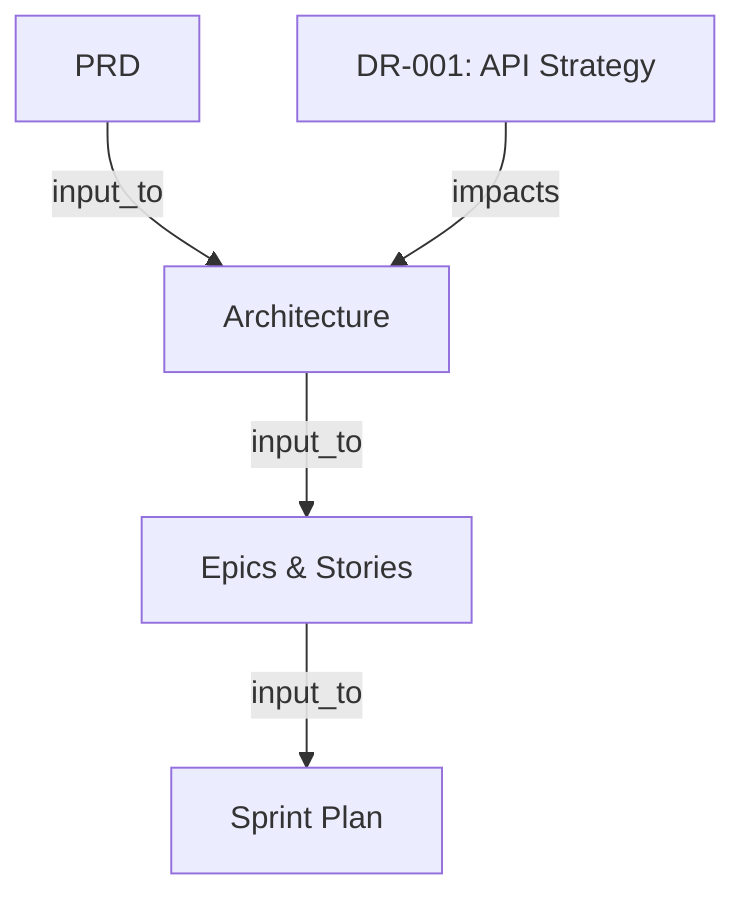

# MDAN — Multi-Agent Development Agentic Network


[](https://www.npmjs.com/package/mdan-method)
[](https://github.com/khalilbenaz/MDAN/actions/workflows/ci.yml)
[](LICENSE)
<!-- generated:badges -->
[](#commandes-disponibles)
[](#les-agents)
[](#les-agents)
<!-- /generated:badges -->
[](https://glama.ai/mcp/servers/khalilbenaz/MDAN)

**MDAN** est un framework de développement piloté par l'IA : des agents spécialisés, des wizards interactifs pas-à-pas, une mémoire de projet persistante, un protocole de débat structuré et un graphe de contexte qui trace chaque artifact. Il s'utilise via des slash commands dans ton IDE **ou** comme serveur MCP.

**100% gratuit et open source.** Made in Morocco.

---

## Démarrage rapide

```bash
npx mdan-method install
```

L'installeur (interactif) demande la langue, les packs optionnels, le ou les IDE et ton nom, puis :

- copie le contenu dans `_mdan/` ;
- génère les commandes `/mdan-*` pour chaque IDE choisi ;
- écrit la config (`_mdan/*/config.yaml`) et l'état initial (`_mdan/state/`) ;
- ajoute optionnellement le serveur MCP à `.mcp.json`.

Ensuite, dans ton IDE, tape `/mdan-` pour voir toutes les commandes.

**Non interactif (CI, scripts) :**

```bash
npx mdan-method install --yes --lang fr --ide claude-code,cursor --modules fintech,db-optimization --mcp
```

| Option | Valeurs |
|--------|---------|
| `--lang` | `fr-darija` (défaut) · `fr` · `en` · `darija` |
| `--ide` | `claude-code` (défaut) · `cursor` · `opencode` · `gemini` · `qwen` (plusieurs séparés par des virgules) |
| `--modules` | `fintech` · `devops-azure` · `db-optimization` · `ecosystem` · `all` · `none` |
| `--user` | Ton nom, utilisé par les agents |
| `--mcp` | Ajoute le serveur MCP MDAN à `.mcp.json` |
| `--force` | Écrase les fichiers que tu as modifiés |

**Mise à jour sans perdre tes modifications :**

```bash
npx mdan-method@latest update
```

Chaque fichier installé est tracé par son hash (`_mdan/_config/files-manifest.csv`). Un fichier que tu as modifié n'est jamais écrasé : la nouvelle version est écrite à côté en `<fichier>.mdan-new`. Dans les `config.yaml`, seules les clés gérées (`user_name`, `communication_language`, `project_name`) sont mises à jour.

---

## Serveur MCP

Tout client [MCP](https://modelcontextprotocol.io/) (Claude Code, Claude Desktop, Cursor, …) peut utiliser MDAN directement.

```json
{
  "mcpServers": {
    "mdan": {
      "command": "npx",
      "args": ["-y", "mdan-method", "serve"],
      "env": { "MDAN_PROJECT_ROOT": "." }
    }
  }
}
```

```bash
mdan serve                                # stdio (défaut)
mdan serve --http --port 3100             # Streamable HTTP sur /mcp, health check sur /health
docker build -t mdan-mcp . && docker run -i --rm -v "$PWD:/workspace" mdan-mcp
```

Sans installation dans le projet, le serveur sert le contenu embarqué dans le package. Le graphe et les decision records sont quand même écrits dans le projet.

**Outils**

| Outil | Description |
|-------|-------------|
| `mdan_list_workflows` / `mdan_run_workflow` | Liste les workflows / charge un wizard (`name` en enum, `topic` optionnel) |
| `mdan_list_agents` / `mdan_consult_agent` | Liste les agents / charge un persona avec la personnalisation du projet |
| `mdan_party_mode` | Session multi-agent : `discussion`, `debate` ou `consensus` |
| `mdan_create_decision_record` | Enregistre un DR-XXX (ids séquentiels) et l'ajoute au graphe, avec des arêtes `impacts` |
| `mdan_graph_add_node` / `mdan_graph_add_edge` | Trace un artifact (hash du fichier enregistré) / une relation (cycles refusés) |
| `mdan_graph_impact` | Dépendances amont et impact aval d'un artifact |
| `mdan_graph_stale` | Artifacts modifiés depuis leur enregistrement et artifacts aval à revoir |
| `mdan_graph_visualize` | Diagramme Mermaid du graphe |
| `mdan_ecosystem_search` / `mdan_ecosystem_read` | Recherche classée (nom, description) et lecture des skills, agents et commandes de `~/.claude` |
| `mdan_ecosystem_catalog` / `mdan_ecosystem_stats` | Catalogue paginé / composants installés |

**Prompts** : chaque workflow (`create-prd`, `create-architecture`, …) et chaque agent (`agent-<nom>`) est aussi exposé comme prompt MCP, ce qui permet au client de les proposer comme slash commands.

**Ressources** : `mdan://state`, `mdan://config`, `mdan://graph`.

> Migration depuis la v3 : les outils `mdan_workflow_<nom>` et `mdan_agent_<nom>` sont remplacés par `mdan_run_workflow { name }` et `mdan_consult_agent { name }`, et les noms utilisent désormais `_` (`mdan_list_workflows`, `mdan_graph_add_node`, …).

---

## Context Graph

DAG des artifacts du projet et de leurs relations (`input_to`, `derived_from`, `impacts`, `references`). À la fin d'un workflow, l'agent enregistre l'artifact produit via `mdan_graph_add_node`. Les decision records des débats y sont ajoutés automatiquement.

```bash
mdan graph                  # Mermaid
mdan graph --json           # JSON brut
mdan graph --html graph.html
mdan impact <artifact-id>   # amont + aval
mdan stale                  # artifacts modifiés et ce qu'il faut revoir (exit code 2 s'il y en a)
mdan stale --touch <id>     # marque un artifact comme revu
```


```mermaid
graph TD
  prd[PRD] -->|input_to| arch[Architecture]
  arch -->|input_to| epics[Epics & Stories]
  epics -->|input_to| sprint[Sprint Plan]
  dr-001[DR-001: API Strategy] -->|impacts| arch
```

---

## Commandes disponibles

Toutes les commandes commencent par `/mdan-`.

### Wizards — Phase 1 : Découverte

| Commande | Description |
|----------|-------------|
| `/mdan-create-product-brief` | Product brief collaboratif en 6 étapes : vision, utilisateurs cibles, scope, métriques de succès. |
| `/mdan-market-research` | Recherche de marché : analyse concurrentielle, comportement clients, pain points, opportunités. |
| `/mdan-technical-research` | Recherche technique : technologies, patterns d'architecture, intégrations, tendances. |
| `/mdan-domain-research` | Recherche de domaine : analyse sectorielle, réglementation, paysage concurrentiel. |

### Wizards — Phase 2 : Planification

| Commande | Description |
|----------|-------------|
| `/mdan-create-prd` | PRD complet en 12 étapes : vision, user journeys, scoping, exigences fonctionnelles et non fonctionnelles. |
| `/mdan-create-ux-design` | Design UX en 14 étapes : discovery, design system, fondations visuelles, parcours, composants, responsive. |

### Wizards — Phase 3 : Architecture

| Commande | Description |
|----------|-------------|
| `/mdan-create-architecture` | Architecture technique en 8 étapes : contexte, décisions, patterns, structure, validation. |
| `/mdan-create-epics-and-stories` | Découpe les exigences en epics et user stories prêtes pour le développement. |

### Wizards — Phase 4 : Construction

| Commande | Description |
|----------|-------------|
| `/mdan-sprint-planning` | Sprint plan depuis les epics, avec estimation. |
| `/mdan-dev-story` | Implémente une story depuis sa spec : TDD, tests, documentation. |
| `/mdan-code-review` | Review de code adversariale : bugs, sécurité, violations de patterns. |

### Wizards — Phase 5 : Livraison

| Commande | Description |
|----------|-------------|
| `/mdan-document-project` | Documentation complète du projet : overview, deep-dives, source tree. |

### Flows rapides

| Commande | Description |
|----------|-------------|
| `/mdan-quick-dev` | Développement rapide en 6 étapes pour les petits changements. |
| `/mdan-quick-spec` | Spec technique rapide en 4 étapes, prête pour l'implémentation. |

### Modes spéciaux

| Commande | Description |
|----------|-------------|
| `/mdan-party-mode` | Multi-agents en 3 modes : discussion, débat, consensus. |
| `/mdan-debate` | Débat structuré (Partisan 🟢 vs Opposant 🔴 + Arbitre ⚖️), 3 rounds, arbitrage, puis decision record. |
| `/mdan-brainstorming` | Brainstorming avec plus de 12 techniques (SCAMPER, Six Thinking Hats, Mind Mapping…). |

### Tâches

| Commande | Description |
|----------|-------------|
| `/mdan-help` | Que faire ensuite ? Analyse ce qui est fait et conseille la prochaine étape. |
| `/mdan-review-adversarial-general` | Revue critique (adversariale) d'un contenu. |
| `/mdan-editorial-review-prose`, `/mdan-editorial-review-structure` | Relecture éditoriale (style, structure). |
| `/mdan-shard-doc`, `/mdan-index-docs` | Découpe un gros document ou indexe un dossier de docs. |

### CLI

| Commande | Description |
|----------|-------------|
| `mdan install` / `mdan update` | Installe / met à jour MDAN dans un projet |
| `mdan serve [--http]` | Démarre le serveur MCP |
| `mdan graph`, `mdan impact <id>`, `mdan stale` | Context Graph |
| `mdan validate` | Vérifie que toutes les références de fichiers de `_mdan/` existent |

---

## Les Agents

Les agents sont des personas IA spécialisés, invocables directement. Cette table est générée depuis les fichiers agents par `npm run build`.

<!-- generated:agents -->
### Cœur

| Commande | Agent | Rôle |
|----------|-------|------|
| `/mdan-agent-mdan-master` | 🧙 MDAN Master | **Orchestrateur Principal, Gardien du Contexte, Directeur des Wizards** — Master Orchestrator + MDAN Expert + Context Guardian |

### Pack Database Optimization

| Commande | Agent | Rôle |
|----------|-------|------|
| `/mdan-agent-db-optimization-indexing-specialist` | 📑 Salma | **Indexing Specialist** — Database Indexing Strategy Expert |
| `/mdan-agent-db-optimization-performance-analyst` | 📈 Mehdi | **DB Performance Analyst** — Database Performance Analysis Expert |
| `/mdan-agent-db-optimization-query-optimizer` | 🔍 Driss | **Query Optimizer** — Database Query Optimization Expert |

### Pack DevOps & Azure

| Commande | Agent | Rôle |
|----------|-------|------|
| `/mdan-agent-devops-azure-azure-specialist` | ☁️ Reda | **Azure Specialist** — Azure Cloud Architecture Expert |
| `/mdan-agent-devops-azure-cicd-architect` | 🔄 Yassine | **CI/CD Architect** — CI/CD Pipeline Architecture Expert |
| `/mdan-agent-devops-azure-devops-engineer` | ⚙️ Omar | **DevOps Engineer** — DevOps Engineering and Operations Expert |

### Pack Ecosystem

| Commande | Agent | Rôle |
|----------|-------|------|
| `/mdan-agent-ecosystem-ia-master` | 🧠 Fayçal | **IA Master** — IA Master — Chief AI Strategist, owns all AI/ML architecture, orchestrates 130+ AI skills and 48 AI agents. Reports to Khalil (MDAN Master) for project-level decisions. |
| `/mdan-agent-ecosystem-data-scientist` | 📊 Saad | **Data Scientist** — Data Scientist — orchestrates data analysis, visualization, and ML skills |
| `/mdan-agent-ecosystem-devops-commander` | 🚀 Youssef | **DevOps Commander** — DevOps Commander — orchestrates 30+ DevOps skills, 39 infra agents, 11 deployment commands |
| `/mdan-agent-ecosystem-fullstack-architect` | 🏗️ Amine | **Fullstack Architect** — Fullstack Architecture Expert — routes to 200+ development skills and 100+ dev agents |
| `/mdan-agent-ecosystem-marketing-strategist` | 📈 Imane | **Marketing Strategist** — Marketing Strategist — orchestrates 25+ marketing skills and publishing commands |
| `/mdan-agent-ecosystem-product-lead` | 💡 Adnane | **Product Lead** — Product Lead — orchestrates product, project management, and team skills |
| `/mdan-agent-ecosystem-research-team-lead` | 🔬 Leila | **Deep Research Team Lead** — Deep Research Orchestrator — coordinates research teams using ecosystem agents and scientific skills |
| `/mdan-agent-ecosystem-security-specialist` | 🛡️ Samir | **Security Specialist** — Security Expert — orchestrates 40+ security skills and 21 security agents |
| `/mdan-agent-ecosystem-skill-dispatcher` | 🎯 Nadia | **Ecosystem Skill Dispatcher** — Ecosystem Orchestrator — Routes requests to the right specialist from 1,053 skills, 418 agents, 340 commands |

### Pack FinTech

| Commande | Agent | Rôle |
|----------|-------|------|
| `/mdan-agent-fintech-compliance-officer` | ⚖️ Rachid | **Compliance Officer** — Regulatory Compliance and Risk Assessment Expert |
| `/mdan-agent-fintech-financial-analyst` | 📊 Amina | **Financial Analyst** — Financial Analysis and Modeling Expert |
| `/mdan-agent-fintech-risk-manager` | 🛡️ Karim | **Risk Manager** — Financial Risk Management Expert |

### qa

| Commande | Agent | Rôle |
|----------|-------|------|
| `/mdan-agent-qa-test-architect` | 🧪 Fatima | **Test Architect** — Test Architecture & Quality Gate Expert |
<!-- /generated:agents -->

Le mode Party utilise en plus l'équipe de personas définie dans `_mdan/mdan/teams/default-party.csv`.

---

## Langue et style de communication

La langue se choisit à l'installation (`--lang`) et est stockée dans `_mdan/mdan/config.yaml` (`communication_language`). Toutes les règles de langue et de style sont centralisées dans **`_mdan/core/rules.md`**, que chaque agent et chaque wizard charge. Changer de langue revient donc à modifier une seule clé.

Le style par défaut est ultra-concis : outil d'abord, résultat d'abord, pas de remplissage, pas de récapitulatif superflu.

---

## Architecture

```
_mdan/                          ← Contenu (source de vérité)
├── core/                       ← Moteur : mdan-master, rules.md, tasks, workflow.xml
├── mdan/                       ← Module principal : workflows, équipes, config
├── fintech/ devops-azure/ db-optimization/ ecosystem/   ← Packs optionnels
├── _config/                    ← Manifests générés + personnalisation des agents
└── state/                      ← État runtime (MDAN-STATE.json, context-graph.json)

tools/
├── build/                      ← build.js (manifests + commandes), validate.js (références)
├── cli/                        ← mdan install|update|serve|graph|impact|stale|validate
├── lib/                        ← sources, commandes IDE, CSV, chemins sûrs, écriture atomique
└── mcp/                        ← serveur MCP (tools, prompts, resources ; stdio + HTTP)
```

---

## Contribuer

```bash
git clone https://github.com/khalilbenaz/MDAN.git && cd MDAN
npm ci
npm run build      # régénère _mdan/_config/*.csv, .claude/commands et les sections générées du README
npm run check      # lint + build à jour + références valides + tests
```

Pour ajouter un agent ou un workflow, crée le fichier source dans `_mdan/<module>/agents/` ou `_mdan/<module>/workflows/` (frontmatter `name` + `description`), puis lance `npm run build`. Il n'y a rien d'autre à maintenir à la main. La CI vérifie que les fichiers générés sont à jour.

---

## Licence

MIT

---

<p align="center">
<!-- generated:footer -->
  <strong>24 wizards · 20 agents · 5 packs · Serveur MCP · Context Graph · Débat/Consensus</strong><br>
<!-- /generated:footer -->
  Conçu au Maroc par <a href="https://github.com/khalilbenaz">@khalilbenaz</a>
</p>
