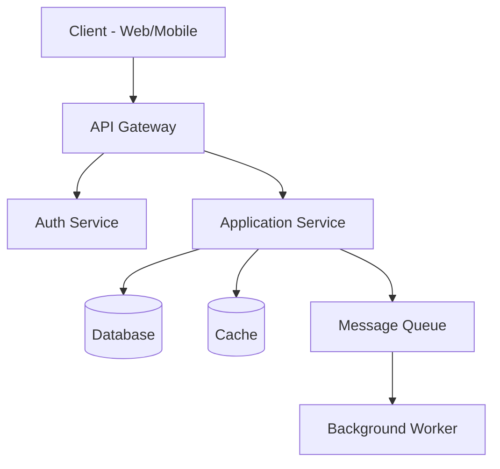

# MDAN Template — Architecture Document

---
**Artifact:** Architecture Document  
**Phase:** DESIGN  
**Agent:** Architect Agent  
**Version:** [X.Y]  
**Status:** Draft | Review | Validated  
**Date:** [YYYY-MM-DD]  
**Project:** [Project Name]  
---

## 1. Architecture Overview

**Pattern chosen:** [Monolith / Microservices / Serverless / Event-driven / Hybrid]  
**Justification:** [Why this pattern for this project]

## 2. System Diagram



## 3. Technology Stack

| Layer | Technology | Version | Justification |
|-------|-----------|---------|---------------|
| Frontend | [e.g., React] | [18.x] | [Reason] |
| Backend | [e.g., Node.js] | [20.x] | [Reason] |
| Database | [e.g., PostgreSQL] | [16.x] | [Reason] |
| Cache | [e.g., Redis] | [7.x] | [Reason] |
| Auth | [e.g., Auth0] | Latest | [Reason] |
| Search | [e.g., N/A] | — | — |
| Queue | [e.g., N/A] | — | — |
| Storage | [e.g., S3] | — | [Reason] |
| Hosting | [e.g., Railway] | — | [Reason] |
| CDN | [e.g., Cloudflare] | — | [Reason] |

## 4. Data Models

```
Entity: User
Fields:
  - id: UUID (PK, auto-generated)
  - email: VARCHAR(255) (UNIQUE, NOT NULL)
  - password_hash: VARCHAR(255) (NOT NULL)
  - display_name: VARCHAR(100) (NOT NULL)
  - role: ENUM('user', 'admin') (DEFAULT 'user')
  - created_at: TIMESTAMP (DEFAULT NOW())
  - updated_at: TIMESTAMP (DEFAULT NOW())
  - deleted_at: TIMESTAMP (NULL, soft delete)

Entity: [Name]
Fields:
  - [field]: [type] ([constraints])
```

**Relationships:**
- User has many [Entity] (1:N)
- [Entity] belongs to User (N:1)

## 5. API Design

**Base URL:** `/api/v1`  
**Auth:** Bearer JWT token in `Authorization` header  
**Format:** JSON request/response  
**Versioning:** URL path versioning (`/v1`, `/v2`)

### Endpoints

| Method | Path | Description | Auth Required |
|--------|------|-------------|---------------|
| POST | `/auth/register` | Register new user | No |
| POST | `/auth/login` | Login | No |
| POST | `/auth/refresh` | Refresh token | Yes |
| GET | `/users/me` | Get current user | Yes |
| GET | `/[resource]` | List resources | Yes |
| POST | `/[resource]` | Create resource | Yes |
| GET | `/[resource]/:id` | Get resource | Yes |
| PUT | `/[resource]/:id` | Update resource | Yes |
| DELETE | `/[resource]/:id` | Delete resource | Yes |

### Error Response Format
```json
{
  "error": {
    "code": "VALIDATION_ERROR",
    "message": "Human-readable message",
    "details": [
      { "field": "email", "message": "Invalid email format" }
    ]
  }
}
```

## 6. Authentication & Authorization

**Authentication:** JWT (access token 15min, refresh token 7 days)  
**Authorization:** Role-Based Access Control (RBAC)

Roles:
- `user` — Standard access to own resources
- `admin` — Full access to all resources

**Token storage:** HttpOnly cookies (not localStorage)

## 7. Security Architecture

| Concern | Solution |
|---------|----------|
| Password storage | Argon2id, min cost 3 |
| API rate limiting | 100 req/min per IP, 1000 req/min per user |
| CORS | Whitelist: [domains] |
| HTTPS | Enforced, HSTS header |
| Secret management | Environment variables only |
| SQL injection | ORM with parameterized queries |
| XSS | Output encoding, CSP headers |

## 8. Non-Functional Requirements

| Requirement | Target | Strategy |
|-------------|--------|----------|
| Response time | p95 < 200ms | Caching, DB indexing |
| Availability | 99.9% | Health checks, auto-restart |
| Data retention | [X months] | Soft deletes, archiving |
| Backup | Daily | Automated DB backup |

## 9. Project Structure

```
[project-name]/
├── src/
│   ├── config/          # Environment and app configuration
│   ├── middleware/       # Express/framework middleware
│   ├── modules/
│   │   └── [feature]/
│   │       ├── [feature].controller.ts
│   │       ├── [feature].service.ts
│   │       ├── [feature].repository.ts
│   │       ├── [feature].dto.ts
│   │       └── [feature].test.ts
│   ├── shared/           # Shared utilities, types, constants
│   └── index.ts          # App entry point
├── tests/
│   ├── integration/
│   └── e2e/
├── mdan_output/
├── .env.example
├── Dockerfile
├── docker-compose.yml
└── README.md
```

## 10. Coding Conventions

- **Language:** [TypeScript 5.x]
- **Style guide:** [Airbnb / Standard / PEP8]
- **Linting:** [ESLint + Prettier / Ruff]
- **Naming:**
  - Variables/functions: camelCase
  - Classes: PascalCase
  - Constants: UPPER_SNAKE_CASE
  - Files: kebab-case
- **Git branches:** `main` → `develop` → `feature/[name]`
- **Commit format:** `type(scope): description` (Conventional Commits)

## 11. Architecture Decision Records

### ADR-001: [Decision Title]
- **Status:** Accepted
- **Date:** [YYYY-MM-DD]
- **Context:** [Why this decision was needed]
- **Decision:** [What was decided]
- **Consequences:** [Trade-offs, positive and negative]

---

*Architecture validated by:* ________________  
*Date:* ________________
